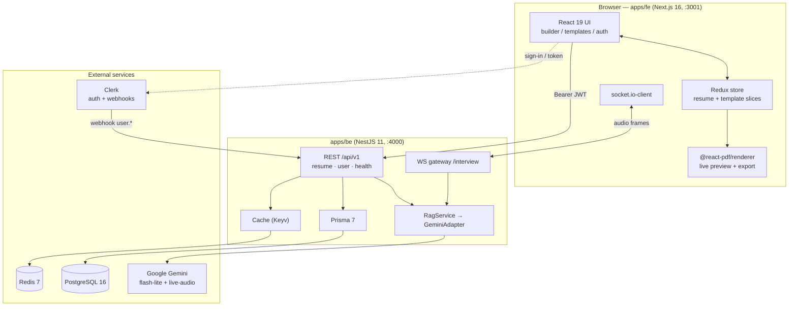
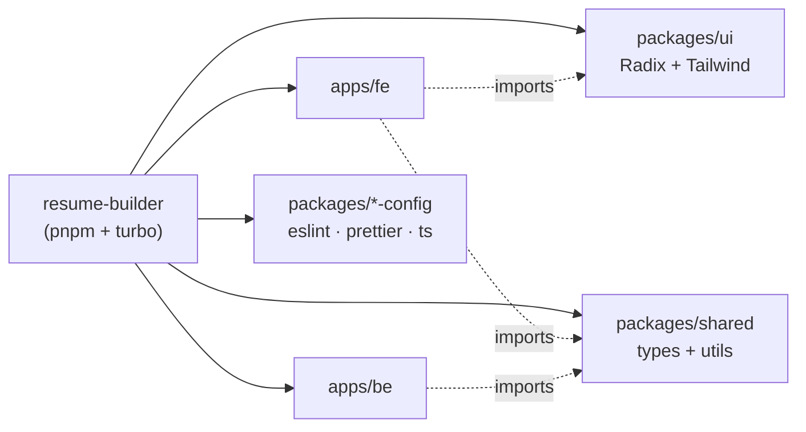
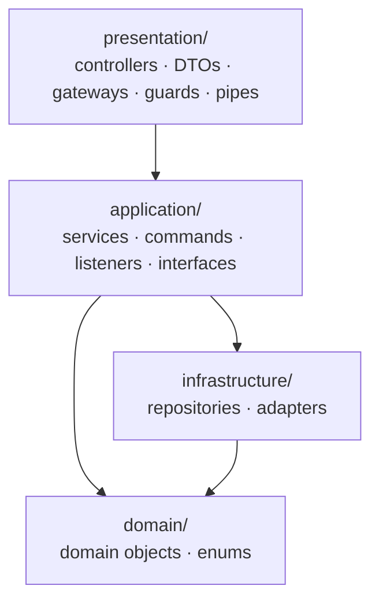
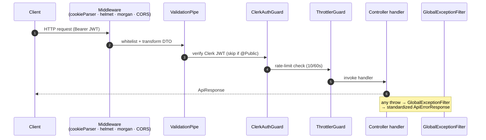
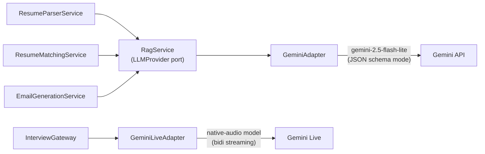

# Architecture

How the system is composed and how a request flows end to end. Per-feature flows live under [Features](features/resume-editor.md).

---

## System overview

---

## Monorepo layout

Turbo orchestrates tasks across workspaces; `build` is cached and `dev` is persistent. See [Project Overview](resume-builder.md).

---

## Backend layering (per module)

Every feature module (`resume`, `user`, `rag`, `interview`) follows the same hexagonal-ish split:

- **presentation** — HTTP/WS entry points + validation
- **application** — use-case orchestration (services), interfaces (ports)
- **domain** — pure business types
- **infrastructure** — adapters that fulfill the ports (Prisma repos, Gemini adapter)

---

## Request lifecycle (HTTP)

Order of middleware/guards a request passes through, from `main.ts` + global providers:

---

## Authentication model

Two distinct paths share Clerk:

| Path | Mechanism | Guard |
|---|---|---|
| REST requests | `Authorization: Bearer <Clerk JWT>` | `ClerkAuthGuard` (global, bypass with `@Public`) |
| WebSocket `/interview` | JWT in `handshake.auth.token` | `WsAuthGuard` (socket middleware) |
| Clerk → server webhook | Svix signature | `ClerkWebhookGuard` |

The DB `User` is resolved from the Clerk id on demand by `@CurrentDbUser()` → `UserByClerkIdPipe` → `UserService.findByProviderId()` (Redis-cached). See [Auth & Webhooks](features/auth-and-webhooks.md).

---

## AI integration

All LLM access funnels through one port so providers stay swappable:

- Non-streaming features request **structured JSON** validated against a per-feature schema (`RESUME_SCHEMA`, `MATCH_CV_JD_SCHEMA`, `GENERATE_EMAIL_SCHEMA`, `EVALUATION_SCHEMA`).
- User-supplied text is run through `PromptSanitizer` before being embedded in prompts (prompt-injection defense).

---

## Data & caching

- **PostgreSQL** via Prisma — one `User` ↔ one `Resume` (+ child sections). See [Database Schema](database.md).
- **Redis** via Keyv — caches `user:provider:{id}` and `resume:user:{id}` (5-min TTL, 60s for nulls). Mutations invalidate the related keys.

---

## Feature deep-dives

- [Resume Editor & Live Preview](features/resume-editor.md)
- [PDF Export](features/pdf-export.md)
- [Resume Parsing](features/resume-parsing.md)
- [Job Matching](features/job-matching.md)
- [Email Generation](features/email-generation.md)
- [Live Interview](features/live-interview.md)
- [Auth & Webhooks](features/auth-and-webhooks.md)
- [Internationalization](features/i18n.md)
