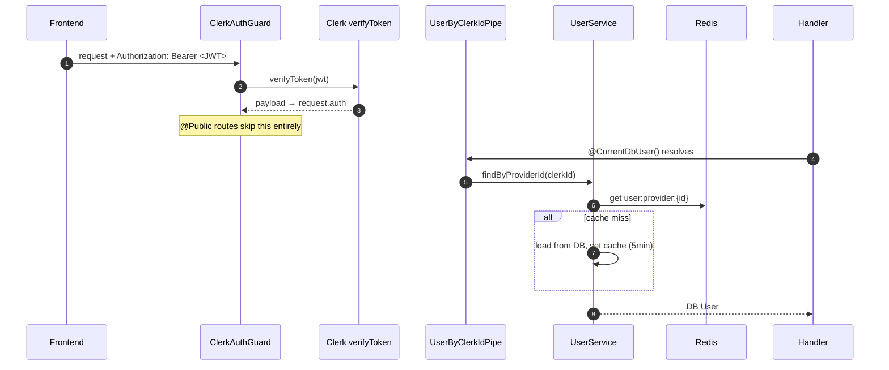
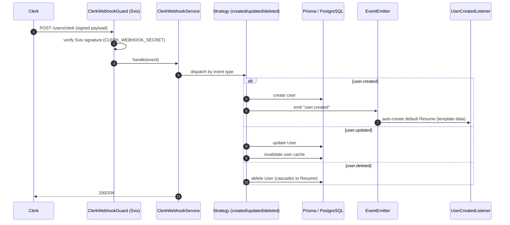

# Auth & Webhooks

Authentication is fully delegated to **Clerk**. The frontend obtains a session JWT; the backend verifies it per request and keeps its own `User` table in sync via Clerk webhooks.

**Key files (`apps/be`):** `libs/guards/clerk-auth.guard.ts`, `libs/decorators/current-user.decorator.ts`, `modules/user/presentation/pipes/user-by-clerk-id.pipe.ts`, `modules/user/application/services/clerk-webhook.service.ts`, `modules/user/application/strategies/*`, `modules/user/presentation/guards/clerk-webhook.guard.ts`, `modules/resume/application/listeners/user-created.listener.ts`.

---

## Request authentication (HTTP)

- **`ClerkAuthGuard`** is global (`APP_GUARD`); it verifies the Clerk JWT and attaches the payload to `request.auth`. Routes marked `@Public()` bypass it. WebSocket contexts are skipped (handled by `WsAuthGuard`).
- **`@CurrentDbUser()`** + **`UserByClerkIdPipe`** lazily resolve the local `User` row from the Clerk id, cached in Redis under `user:provider:{id}` (nulls cached 60 s to avoid penetration).
- **`@CurrentProviderUser()`** exposes the raw Clerk JWT payload when the DB row isn't needed.

---

## Webhook user sync

Clerk calls `POST /api/v1/users/clerk` on user lifecycle events. The route is `@Public` but protected by a **Svix signature** check.

- A **strategy per event type** keeps `ClerkWebhookService` thin (`UserCreatedStrategy`, `UserUpdatedStrategy`, `UserDeletedStrategy`).
- On `user.created`, an event is emitted and **`UserCreatedListener`** (in the resume module) seeds a default `Resume` — this is why a new sign-up immediately has an editable resume.
- On `user.deleted`, the cascade in the schema removes the resume and all child rows.

> Local dev: expose the server via ngrok and register `https://<ngrok>/api/v1/users/clerk` in the Clerk dashboard. See [Dev Setup → Clerk webhook](../dev-setup.md#clerk-webhook-local).

Next: [Internationalization →](i18n.md)
