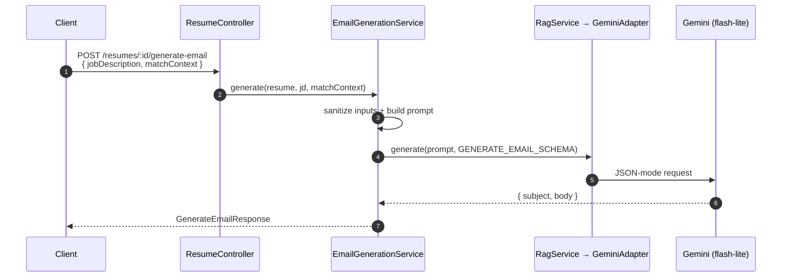

# Email Generation

Generate a tailored job-application email from the résumé, the job description, and the match analysis.

**Endpoint:** `POST /api/v1/resumes/:id/generate-email` (Bearer, throttled 5/min)
**Key files (`apps/be`):** `application/services/email-generation.service.ts`, `presentation/DTOs/generate-email.dto.ts`, `modules/rag/*`.

---

## Flow



**Input** (`GenerateEmailDto`):
```ts
{
  jobDescription: string,
  matchContext: { strengths: string[], suggestions: string[], overallScore: number }
}
```

**Output:** `{ subject, body }` — validated against `GENERATE_EMAIL_SCHEMA`.

The `matchContext` is typically the [Job Matching](job-matching.md) result, so the email leans on identified strengths and addresses gaps. On the client, `ResumeService.generateEmail(resumeId, jd, matchResult)` returns the draft, shown in a preview with copy-to-clipboard.

Next: [Live Interview →](live-interview.md)
