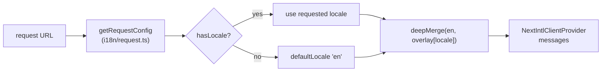

# Internationalization

The frontend ships **11 locales** with English as the base. Translations are deep-merged over English so any missing key gracefully falls back.

**Locales:** `en` (default), `vi`, `ja`, `zh`, `th`, `hi`, `es`, `fr`, `ar`, `ko`, `de`
**Key files (`apps/fe`):** `i18n/routing.ts`, `i18n/request.ts`, `i18n/navigation.ts`, `messages/{locale}.json`, `app/[locale]/layout.tsx`.

---

## Locale resolution

- `routing.ts` declares the locale list, `defaultLocale: 'en'`, and `localePrefix: 'as-needed'` — so English URLs have no prefix (`/builder`) while others do (`/vi/builder`).
- `request.ts` picks the locale, then `deepMerge(en, overlay)` layers the locale file over the English base; untranslated keys inherit English.
- No `middleware.ts` — the `next-intl` plugin wired in `next.config.mjs` handles detection.

## RTL

`app/[locale]/layout.tsx` sets `dir="rtl"` for Arabic (`ar`); layouts rely on logical CSS properties so they reflow without per-component overrides.

## Usage

- Navigation uses the typed helpers from `i18n/navigation.ts` (`Link`, `redirect`, `useRouter`, `usePathname`) so locale prefixes are handled automatically.
- Components read strings via `useTranslations(namespace)`; server components use `getMessages()` / `setRequestLocale(locale)`.

← Back to [Architecture](../architecture.md)
