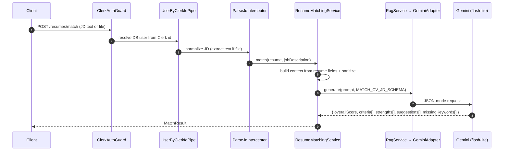

# Job Matching

Compare a résumé against a job description and get a score, strengths, gaps, and suggestions.

**Endpoint:** `POST /api/v1/resumes/match` (Bearer, throttled 5/min). Accepts a JD as text (`MatchResumeDto`) or an uploaded file.
**Key files (`apps/be`):** `application/services/resume-matching.service.ts`, `presentation/interceptors/parse-jd.interceptor.ts`, `modules/rag/*`.

---

## Flow

- The service builds a compact context from the stored resume (skills, experience, projects, summary), sanitizes inputs, and asks Gemini against `MATCH_CV_JD_SCHEMA`.
- Result shape: `overallScore`, `summary`, `criteria[]` (per-dimension breakdown), `strengths[]`, `suggestions[]`, `missingKeywords[]`.

---

## Frontend

`ResumeService.matchResume(resumeId, jdText?, jdFile?)` posts the JD; the UI renders the breakdown across tabs (score criteria, analysis, improvements). The returned `MatchResult` is also the input context for [Email Generation](email-generation.md).

Next: [Email Generation →](email-generation.md)
