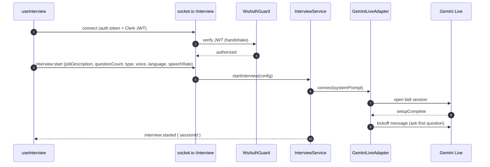
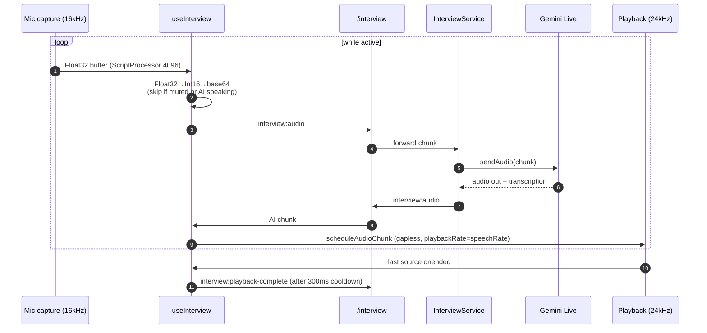
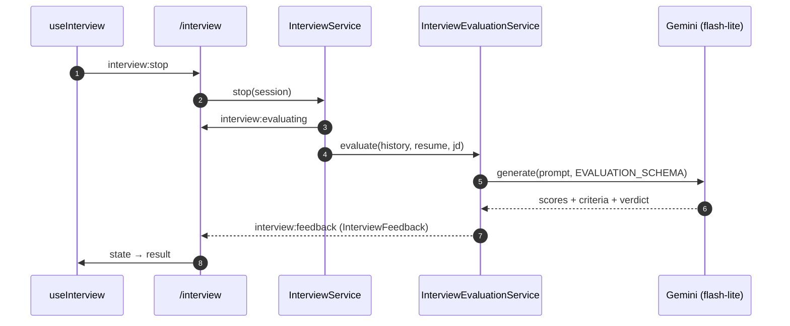

# Live Interview

A real-time, voice-based mock interview. The browser streams microphone audio to the backend, which proxies a bidirectional Gemini Live (native-audio) session and streams the interviewer's voice back. At the end, the transcript is scored.

**Transport:** Socket.IO namespace `/interview`.
**Key files — BE:** `modules/interview/presentation/gateways/interview.gateway.ts`, `presentation/guards/ws-auth.guard.ts`, `application/services/interview.service.ts`, `application/services/interview-evaluation.service.ts`, `infrastructure/adapters/gemini-live.adapter.ts`.
**Key files — FE:** `hooks/useInterview.ts`, `services/interview.service.ts`.

---

## Socket events

| Direction | Event | Payload |
|---|---|---|
| C → S | `interview:start` | `StartInterviewDto` |
| C → S | `interview:audio` | `{ audio }` base64 PCM (16 kHz) |
| C → S | `interview:playback-complete` | — (client finished playing AI audio) |
| C → S | `interview:stop` | — |
| S → C | `interview:started` | `{ sessionId }` |
| S → C | `interview:audio` | `{ audio }` base64 PCM (24 kHz) |
| S → C | `interview:turn-complete` | `{ questionNumber, totalQuestions }` |
| S → C | `interview:interrupted` | — |
| S → C | `interview:evaluating` | — |
| S → C | `interview:feedback` | `InterviewFeedback` |
| S → C | `interview:session-lost` / `interview:error` | `{ message }` |

---

## Connection & start

---

## Audio loop (full duplex)

**Client audio details (`useInterview`):**
- Two `AudioContext`s — capture at **16 kHz** (mic, with echo-cancellation/noise-suppression/AGC) and playback at **24 kHz**.
- Outgoing: `ScriptProcessorNode` (4096) → clamp+scale Float32 → Int16 → base64. Chunks are dropped while muted or while the AI is speaking (half-duplex gating).
- Incoming: base64 → Int16 → Float32 → `AudioBuffer`; scheduled gaplessly via `nextPlayTime = max(ctx.currentTime, nextPlayTime)` and stretched by `playbackRate = speechRate`.
- When the last buffer's `onended` fires and the active-source count hits 0, the client waits 300 ms then emits `interview:playback-complete` so the server can re-open the mic turn.
- A canvas waveform reads `getByteFrequencyData` from the mic analyser (user turn) or playback analyser (AI turn).

**Server turn/silence handling (`InterviewService`):**
- Accumulates `inputTranscription` / `outputTranscription` per turn into a conversation history (with `nudged` / `skipped` / `role` metadata).
- On turn completion, increments the question counter and emits `interview:turn-complete`.
- Two-tier silence timer: nudge the candidate after `SILENCE_TIMEOUT_MS`; skip the question after `SILENCE_AFTER_NUDGE_TIMEOUT_MS`.
- Barge-in / VAD cut-off emits `interview:interrupted`.

---

## Stop & evaluation

The client state machine moves `idle → setup → connecting → active → evaluating → result` (with an `error` branch on `interview:error` / `interview:session-lost`).

> Models: the interview uses the native-audio model from `GEMINI_LIVE_MODEL` (default `gemini-2.5-flash-native-audio-preview-12-2025`); evaluation uses `gemini-2.5-flash-lite`.

Next: [Auth & Webhooks →](auth-and-webhooks.md)
