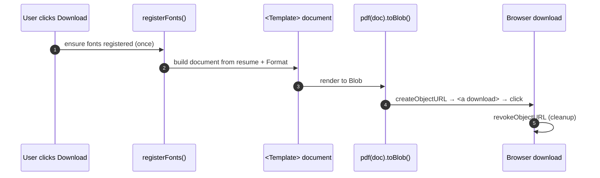

# PDF Export

The same `@react-pdf/renderer` document that powers the live preview is serialized to a downloadable PDF on demand.

**Key files (`apps/fe`):** `configs/font.config.ts`, `components/templates/*`, `components/builder-screen/resume-control.tsx`.

---

## Flow

1. **Fonts** — `registerFonts()` calls `Font.register()` for each family (Inter, Roboto, Open Sans, Lato, Lobster Two) loading `/public/fonts/{family}/*.ttf` at the declared weights. A guard flag prevents duplicate registration.
2. **Document** — the selected template component renders `<Page size="A4">` with sections drawn in `Format.sectionOrder`, skipping `hiddenSections`.
3. **Serialize** — `pdf(doc).toBlob()` produces the file.
4. **Download** — filename is `slugify(title + subTitle)-YYYY-MM-DD.pdf`; an `<a>` with `href=URL.createObjectURL(blob)` is clicked, then the object URL is revoked.

> `@react-pdf/renderer` and `@rawwee/react-pdf-html` are listed in `serverExternalPackages` so Next.js doesn't bundle them — they run as native modules.

Next: [Resume Parsing →](resume-parsing.md)
