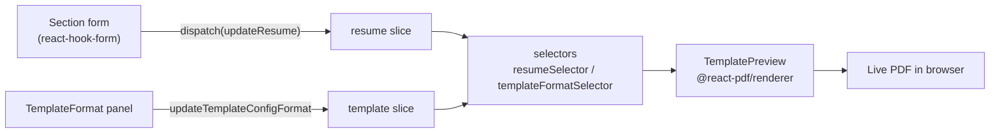
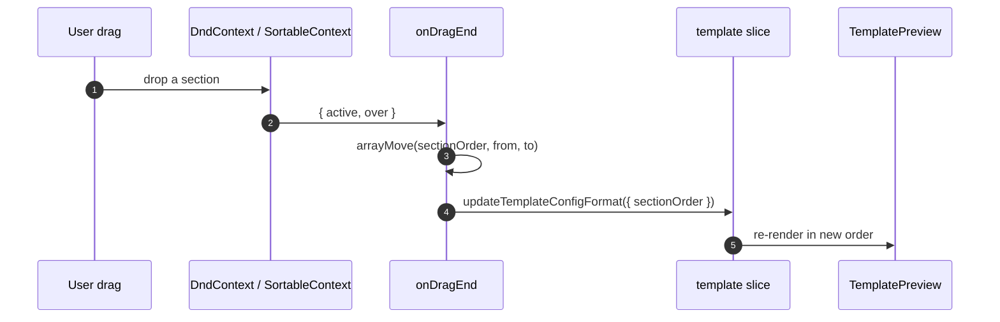
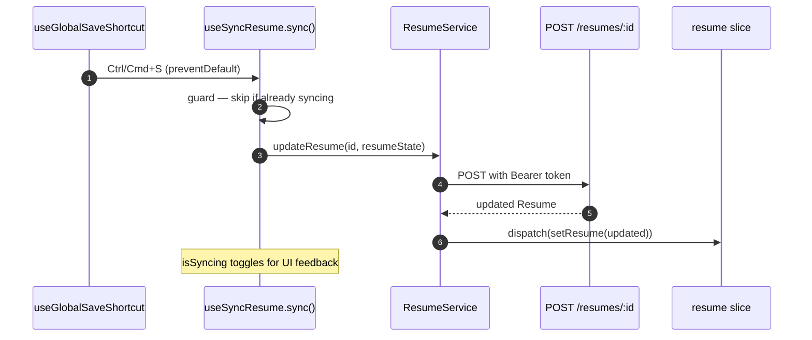

# Resume Editor & Live Preview

The core editing experience: a sectioned form on the left, a live PDF preview on the right, and one-keystroke save. State lives in Redux; the preview is a pure function of that state.

**Key files (`apps/fe`):**
`app/[locale]/(main-layout)/builder/page.tsx`, `components/builder-screen/*` (forms, `template-preview`, `template-format`, `resume-control`), `stores/features/resume.slice.ts`, `stores/features/template.slice.ts`, `hooks/useSyncResume.ts`, `hooks/useGlobalSaveShortcut.ts`.

---

## Data flow

- A field edit calls `dispatch(updateResume(partial))` — a shallow merge into `state.resume`.
- The template settings panel dispatches `updateTemplateConfigFormat(Partial<Format>)`.
- `TemplatePreview` subscribes via `resumeSelector` + `templateFormatSelector`, so any change re-renders the PDF immediately. The `previewMode` flag swaps the center pane between the form and a full-page preview.

---

## Section reordering (dnd-kit)

`hiddenSections` works the same way — toggling visibility dispatches a format update, and the section registry skips hidden keys when rendering.

---

## Save flow (Ctrl/Cmd+S or Save button)

`useSyncResume` returns `{ sync, isSyncing, resume }` and uses a ref flag to prevent overlapping requests. The backend response replaces local state via `setResume`, so server-generated ids/timestamps flow back in.

---

## The `Format` object

`template.slice` holds a `Format` that fully describes presentation — typography (`fontSize`, `fontFamily`, `titleSize`, `lineHeight`, `fontWeight`, `letterSpacing`), layout (`sectionSpacing`, `margin`, `columnLayout`, `sectionOrder`, `hiddenSections`, `headerStyle`), and appearance (`color` default `#1e3a8a`, `theme`, `borderStyle`, `dateFormat` default `MM/YYYY`). The `use-template-0{1..5}-style` hooks turn this object into `@react-pdf/renderer` StyleSheets, so changing a slider re-styles the preview without touching resume content.

Next: [PDF Export →](pdf-export.md)
