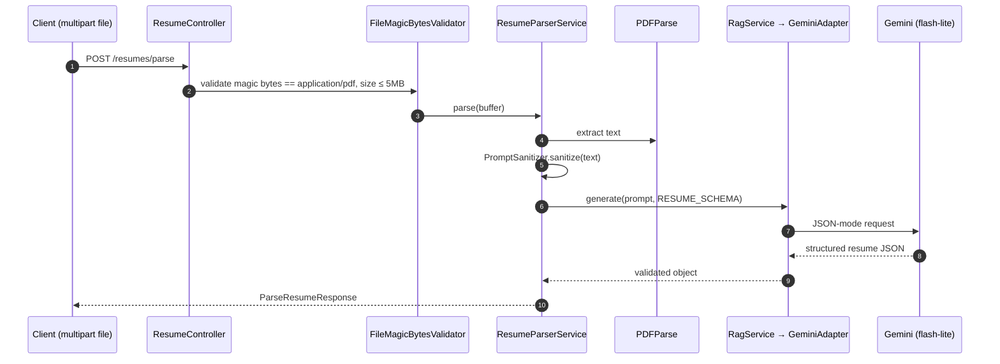
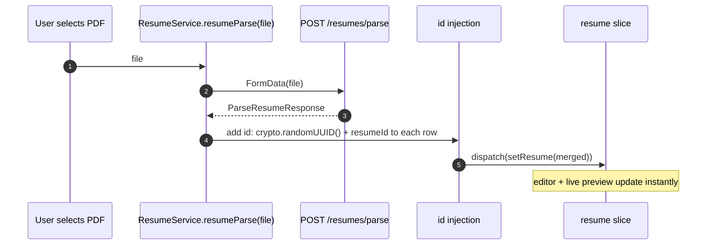

# Resume Parsing

Upload a PDF résumé and have Gemini extract it into the structured resume model, then auto-fill the editor.

**Endpoint:** `POST /api/v1/resumes/parse` (Bearer, throttled 5/min, multipart `file` ≤ 5 MB)
**Key files (`apps/be`):** `modules/resume/presentation/controllers/resume.controller.ts`, `application/services/resume-parser.service.ts`, `libs/pipes/file-magic-bytes.pipe.ts`, `modules/rag/*`.

---

## Backend flow

- **`FileMagicBytesValidator`** checks the real file signature (not the client-sent MIME header), tolerating BOM/whitespace — only genuine PDFs pass.
- Extracted text is **sanitized** before being embedded in the prompt.
- Gemini runs in **JSON-schema mode** against `RESUME_SCHEMA`, so the response is shape-validated; a parse failure surfaces as `InternalServerErrorException`.

Response is the full resume shape: `title, subTitle, overview, avatar, information[], educations[], skills[], workExperiences[], projects[], certifications[], languages[]`.

---

## Frontend fill

The returned arrays get client-side `id`s (and the current `resumeId`) before being merged into Redux, so they're immediately editable and saveable via the normal [save flow](resume-editor.md#save-flow-ctrlcmds-or-save-button).

Next: [Job Matching →](job-matching.md)
